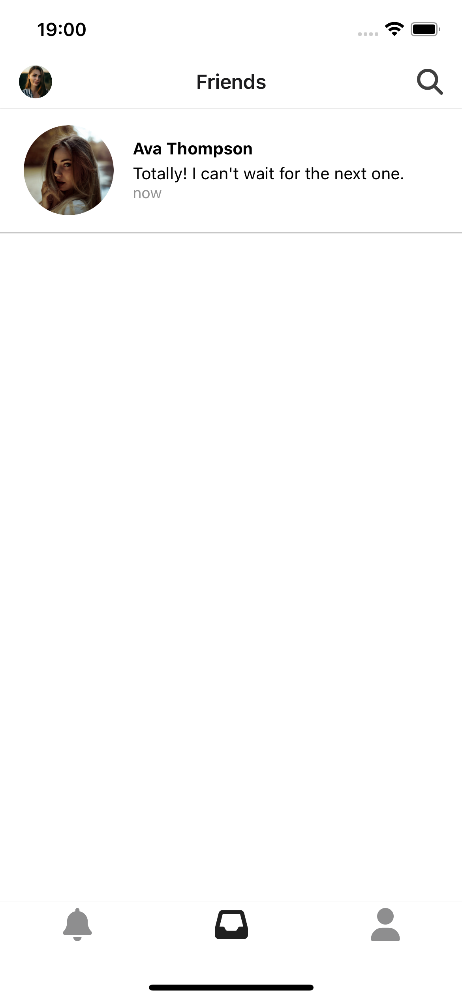

# 🟢 Realtime Chat Application

This is a full-stack real-time chat application built with Django and Channels for the backend and modern JavaScript for the frontend. The project demonstrates how to build scalable, responsive web applications using WebSockets for real-time bi-directional communication.

You can use this app to send and receive messages instantly between connected users, see active conversations, and test a minimal yet functional messaging UI.

<div style="display: flex; justify-content: space-between;">
    
    
    
</div>

## 🚀 Features

- 🔒 **User Authentication**: Register and log in securely.
- 💬 **Real-time Messaging**: Send and receive chat messages instantly via WebSockets (powered by Django Channels).
- 🧑‍🤝‍🧑 **User Presence**: See who’s online and actively chatting.
- 🕓 **Message History**: Chat history is preserved in the database (SQLite by default).
- 🧰 **Modular Structure**: Clean project layout separating concerns (API, app logic, templates, routing).
- 🔄 **Asynchronous Support**: Leverages Django Channels + Redis for real-time, async operations.

## 🗂️ Project Structure

```plaintext
realtime-chat/
├── api/               # Backend Django app (WebSocket consumers, routing, authentication)
│   ├── consumers.py   # WebSocket logic (send/receive messages)
│   ├── routing.py     # WebSocket URL routing
│   ├── models.py      # Message and chat models
│   └── views.py       # Auth and page rendering
│
├── app/               # Frontend assets and static files
│   ├── static/        # JavaScript, CSS, media
│   └── templates/     # HTML templates for UI
│
├── manage.py          # Django CLI
├── db.sqlite3         # SQLite database
├── requirements.txt   # Python dependencies
└── README.md          # Project documentation
```

## 🛠️ What You Can Do With This App
- Create a user account and log in to the chat interface.
- Join a global chat room or private conversations.
- Send messages that instantly appear to other online users (no page reloads).

## Start the Project After Cloning

*Redis:*
```sh
brew install redis
redis-server
```

*Create the virtual environment:*
```sh
python -m venv env  # or python3 for macOS/Linux
source env/bin/activate
```

*Install the dependencies from requirements.txt:*
```sh
pip install -r requirements.txt
```

*Install the dependencies for frontend:*
```sh
npm i
```


## Commands
Use to generate a *requirements.txt* file that contains a list of all the installed Python packages in your current environment, along with their respective versions.
```sh
pip freeze > requirements.txt
``` 

*Makefile Windows:*
```sh
mingw32-make.exe Makefile run-android
```

*Open simulator in terminal (macOS):*
```sh
open -a Simulator.app
```